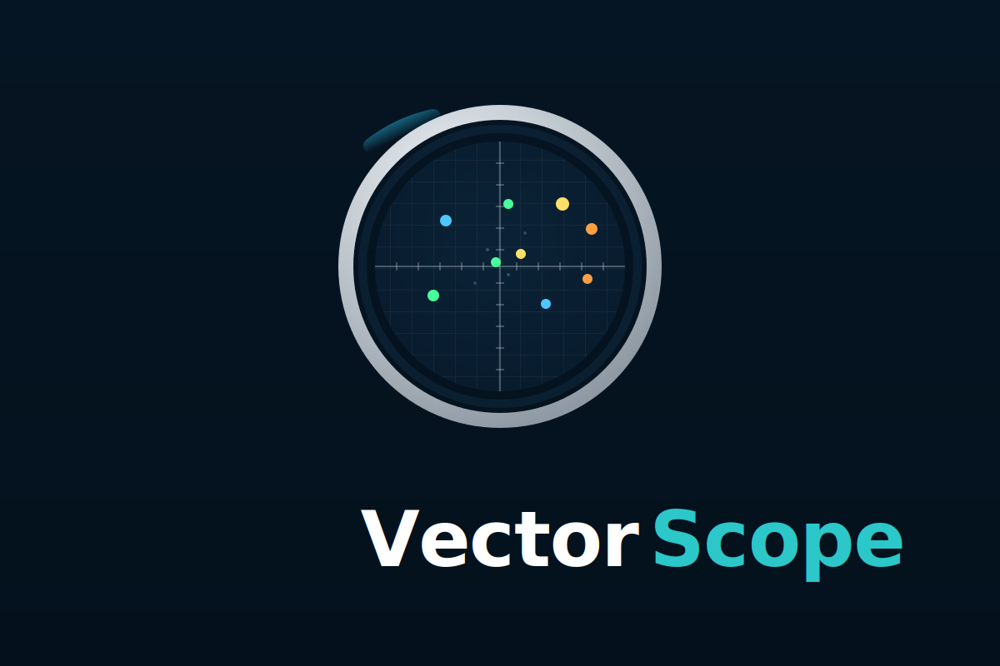

VectorScope Documentation
=========================

VectorScope is an interactive web-based system for exploring, transforming, and visualizing vector embeddings.

.. toctree::
   :maxdepth: 2
   :caption: Getting Started

   installation
   quickstart
   concepts

.. toctree::
   :maxdepth: 2
   :caption: User Guide

   user_guide/loading_data
   user_guide/graph_editor
   user_guide/projections
   user_guide/transformations
   user_guide/annotations
   user_guide/sessions

.. toctree::
   :maxdepth: 2
   :caption: Developer Guide

   developer_guide/architecture
   developer_guide/extending_transformations
   developer_guide/extending_projections
   developer_guide/api_reference

.. toctree::
   :maxdepth: 2
   :caption: API Documentation

   api/backend
   api/frontend

Credits
=======

**Conceptualized by**: `Kyle Cranmer <https://github.com/cranmer>`_

**Implemented by**: `Claude Code <https://claude.ai/claude-code>`_ (Anthropic's AI coding assistant)

Indices and tables
==================

* :ref:`genindex`
* :ref:`modindex`
* :ref:`search`
