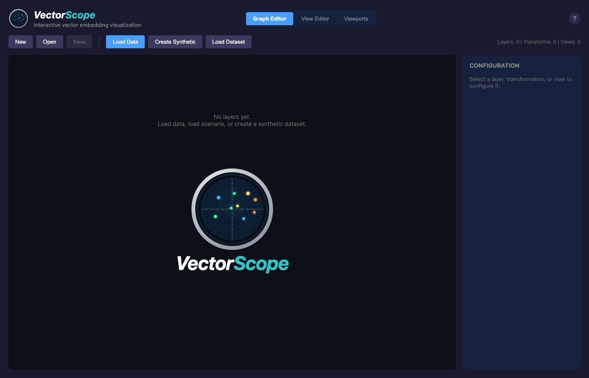
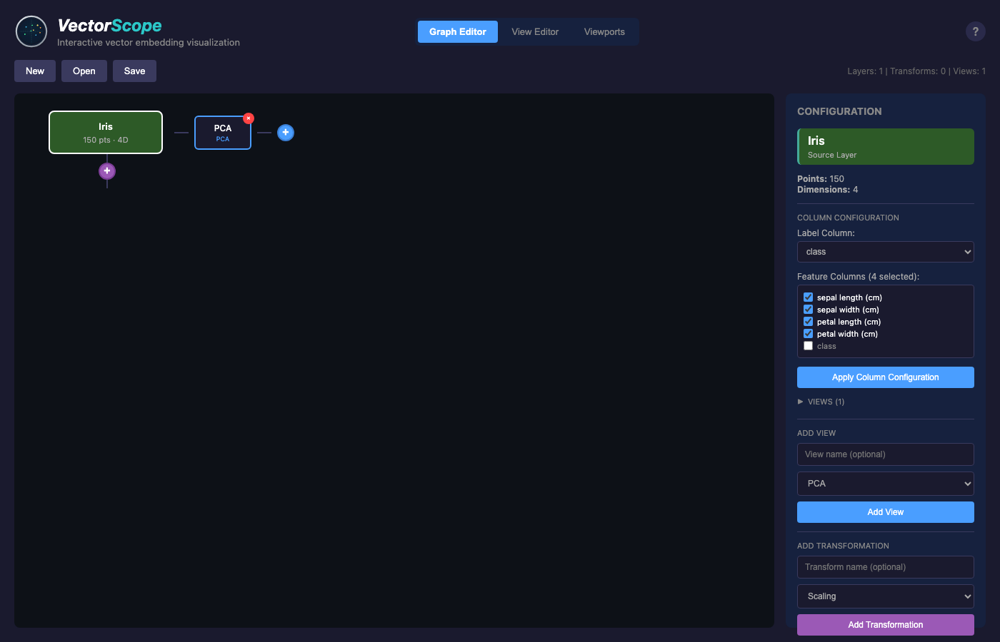
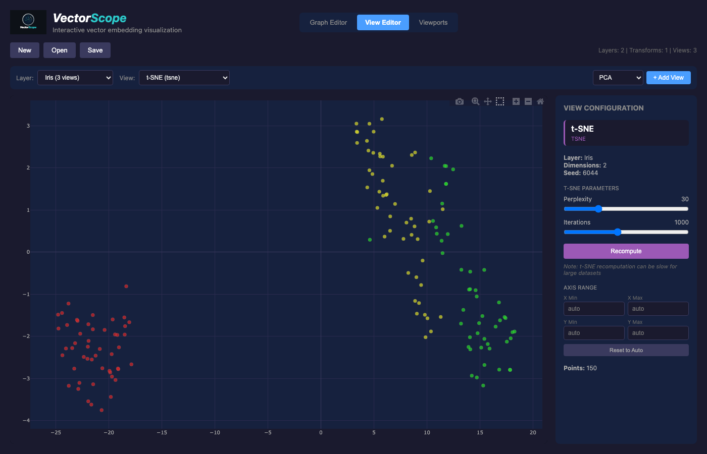
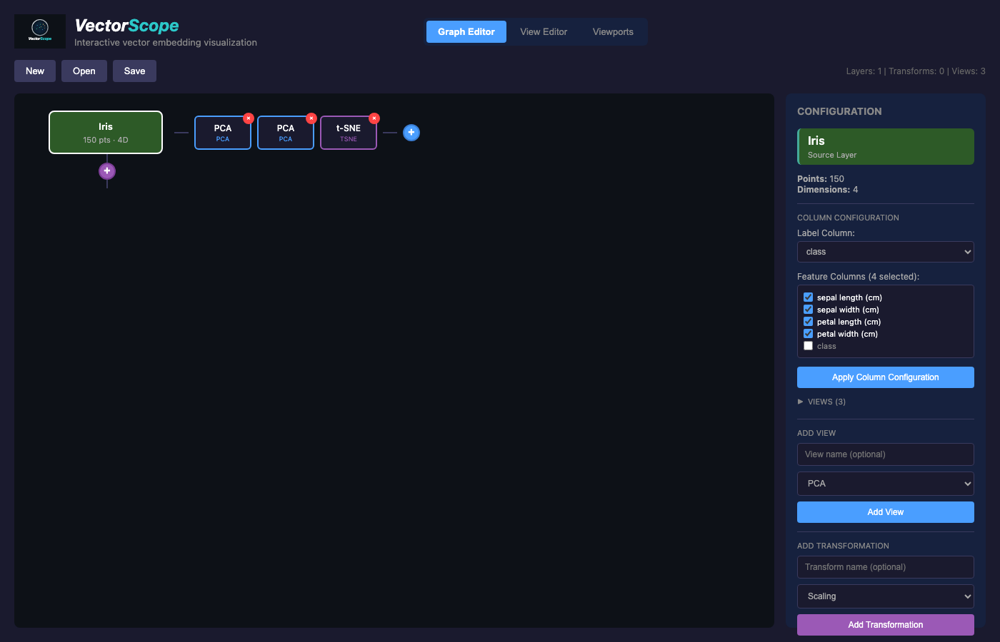
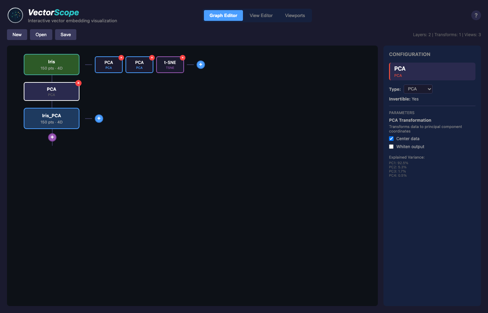
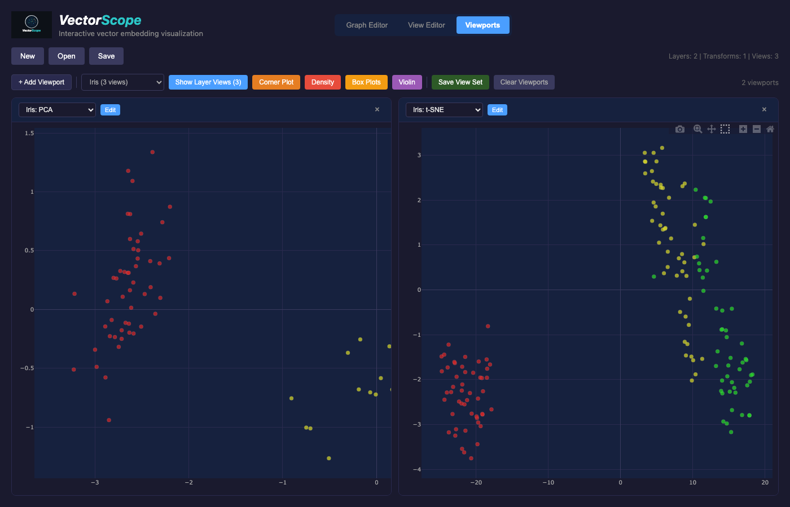

Quickstart
==========

This guide will walk you through your first VectorScope session.

Starting VectorScope
--------------------

1. Start the backend and frontend:

.. code-block:: bash

   pixi run dev

Or start them separately:

.. code-block:: bash

   # Terminal 1: Backend (default port 8000)
   pixi run backend

   # Terminal 2: Frontend (default port 5173)
   cd frontend && npm run dev

2. Open http://localhost:5173 in your browser.

**Configuring Ports**

By default, the backend runs on port 8000 and the frontend on port 5173.

To change the backend port, modify ``pixi.toml``:

.. code-block:: toml

   backend = "uvicorn backend.main:app --reload --port 8001"

To change the frontend port, run with the ``--port`` flag:

.. code-block:: bash

   cd frontend && npm run dev -- --port 3000

.. note::

   If you change the backend port, you must also update the proxy target in
   ``frontend/vite.config.ts`` to match.

Your First Visualization
------------------------

   VectorScope initial state with empty graph editor.

Loading Data
^^^^^^^^^^^^

When VectorScope starts with no data, you'll see three options:

* **Load Data** - Upload your own CSV, NPY, or NPZ file
* **Create Synthetic** - Generate random clustered data
* **Load Dataset** - Use a standard sklearn dataset (Iris, Wine, etc.)

Let's start with the Iris dataset:

1. Click **Load Dataset**
2. Select **Iris** from the list
3. VectorScope automatically creates a PCA projection

Exploring the Graph Editor
^^^^^^^^^^^^^^^^^^^^^^^^^^

The default view is the **Graph Editor**, which shows your data pipeline:

   Graph editor showing the Iris dataset layer.

* **Green node (Iris)** - The source data layer (150 points, 4 dimensions)
* **Blue node (PCA)** - The projection that creates 2D coordinates

Click on a node to see its configuration in the right panel.

Viewing the Data
^^^^^^^^^^^^^^^^

Switch to the **View Editor** tab to see the actual scatter plot:

   View editor with the Iris PCA projection.

1. Select a view from the dropdown (e.g., "Iris: PCA")
2. The plot shows points colored by their class (setosa, versicolor, virginica)
3. Hover over points to see their labels

Adding Another View
^^^^^^^^^^^^^^^^^^^

1. Go back to the **Graph Editor**
2. Click on the **Iris** layer node
3. In the config panel, find "Add View"
4. Select **t-SNE** and click **Add View**

   Graph editor showing a layer with a view node attached.

Now you have two projections of the same data. Switch to **Viewports** mode to see them side by side.

Adding Transformations
^^^^^^^^^^^^^^^^^^^^^^

You can apply transformations to your data before projecting:

1. Click on the layer node
2. In the config panel, click "Add Transformation"
3. Choose a transformation type (scaling, rotation, etc.)

   Graph showing a transformation node between layers.

The transformation creates a new derived layer that you can project separately.

Making a Selection
^^^^^^^^^^^^^^^^^^

Switch to the **Viewports** tab to see multiple views side by side:

   Viewports mode showing multiple projections simultaneously.

1. In any viewport, drag to select a group of points (box selection)
2. Switch between views - your selection is synchronized
3. Click "Clear Selection" to deselect all points

Saving Your Work
----------------

1. Click **Save** in the toolbar
2. Enter a name for your session
3. Your data, projections, and settings are saved

To reload later:

1. Click **Open**
2. Select your saved session

Next Steps
----------

* Learn about :doc:`concepts` - layers, transformations, projections
* Explore :doc:`user_guide/loading_data` - work with your own data
* Read :doc:`user_guide/transformations` - apply scaling, rotation, etc.
